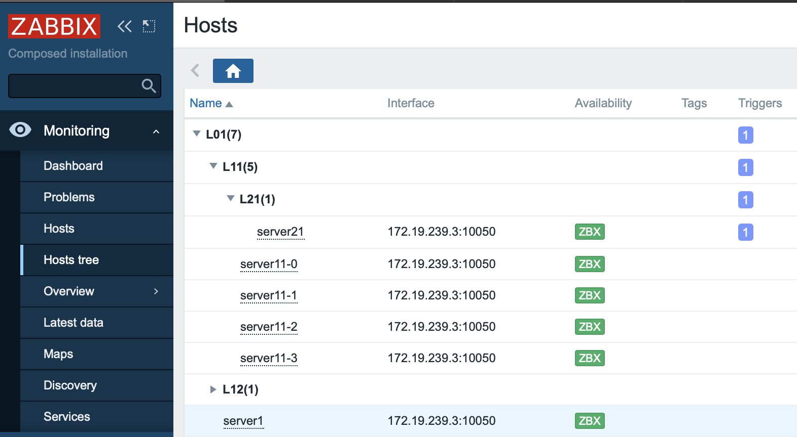

# zabbix-module-hosts-tree
Written according to Zabbix official documentation <https://www.zabbix.com/documentation/current/manual/modules>

A Zabbix module to show groups/hosts as a tree under Monitoring -> Hosts Tree menu item in Zabbix version 5.4.

# How to use
1) Create a folder in your Zabbix server modules folder (by default /usr/share/zabbix/) and copy contents of this repository into that folder.
2) Go to Administration -> General -> Modules click Scan directory and enable the module. You should get new 'Hosts tree' menu item under Monitoring.

## Author
Evgeny Yurchenko
